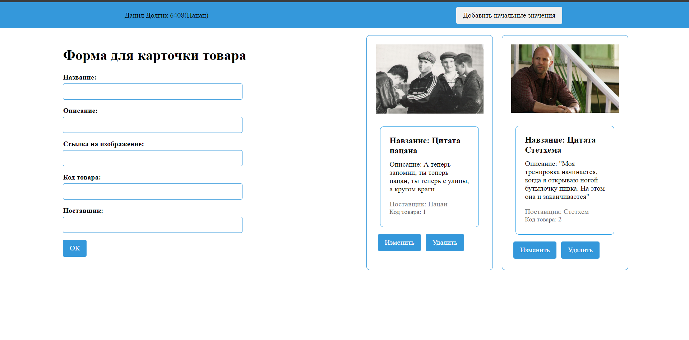

# **Приложение админки карточек (товаров, цитат)** 

## Приложение позволяет отображать, создавать, редактировать и удалять краточки.

При нажатии кнопки "Добавить начальные карточки" появятся две карточки

Добавить цитату можно, при нажатии кнопки "OK цитата отобразится в виде карточки и отправятся на json-server

Интерфейс с созданными карточками: 

## Для старта приложения Неоходимо выполнить две команды: 

### npm i -g json-server 

### json-server --watch db.json
